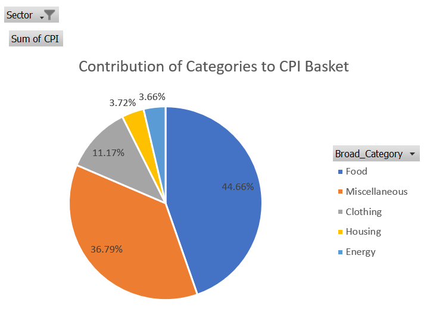
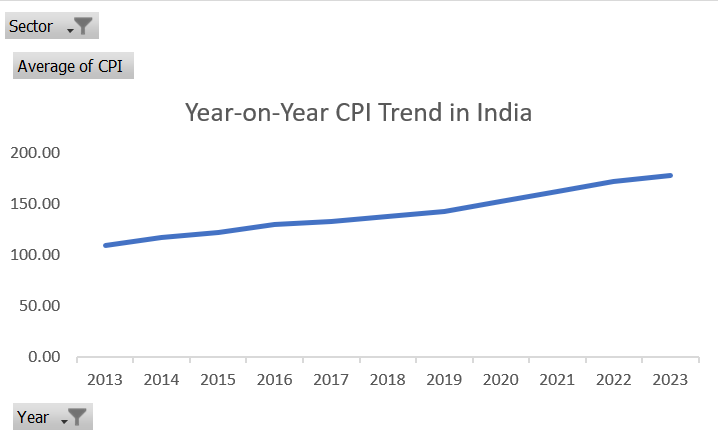
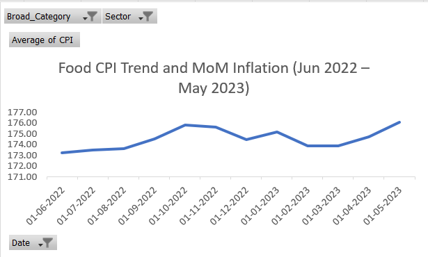
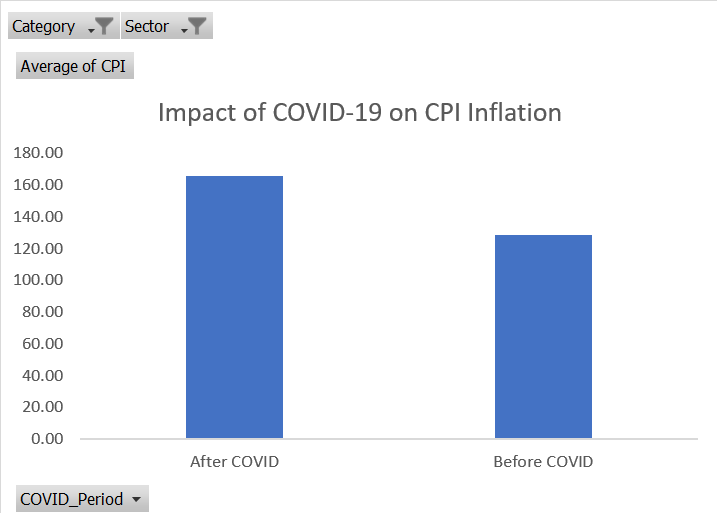
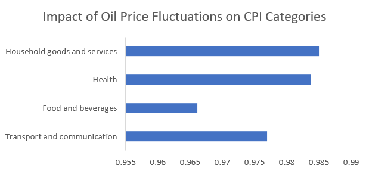

# CPI Inflation Analysis in India (2013–2023)

This project analyzes Consumer Price Index (CPI) trends in India using Excel to understand inflation patterns, category contributions, and economic impacts over time.

## Objectives

1. Analyze the contribution of different categories to the CPI basket.
2. Examine the year-on-year CPI inflation trend.
3. Study food inflation trends for the most recent 12 months.
4. Evaluate the impact of COVID-19 on CPI inflation.
5. Analyze the relationship between oil prices and CPI using correlation.

## Tools Used

- Microsoft Excel
- Pivot Tables
- Data Cleaning
- Correlation Analysis
- Data Visualization

## Key Insights

- Food and beverages contribute the largest share (~45%) to the CPI basket.
- CPI shows a steady upward trend from 2013 to 2023.
- Food inflation shows moderate volatility with monthly fluctuations.
- COVID-19 significantly impacted inflation trends due to supply chain disruptions.
- Oil price fluctuations strongly affect transport and other CPI categories.

## Visualizations

### Contribution of Categories to CPI Basket

### Year-on-Year CPI Trend

### Food CPI Trend

### Impact of COVID-19 on CPI

### Oil Price Impact on CPI Categories

## Files

- `CPI_Inflation_Analysis.xlsx` — Full analysis including pivot tables, charts, and insights.

## Author

Sourav Mukherjee
